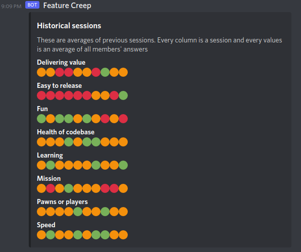

# Feature creep


## Installation

When evaluating this application and you do not require a production-grade setup, we highly recommend using the Docker compose installation method in development mode. Why development mode? Because it allows you to skip deploying the authentication stack to AWS :). 
### Docker

There are 2 Docker compose files available:

- docker-compose.yml

Production mode, authentication will happen via JWTs provided by AWS Cognito. See the folder `infra/auth` 
for details on how its set up

`docker-compose up -d`

- docker-compose-dev.yml

Development mode, any calls to the API are automatically authenticated
This does mean only 1 user can exist in the database at any time, it might get lonely in your solo squad :(

`docker-compose -f docker-compose-dev.yml up -d`

### Server

We developed and tested on Linux systems, YMMV on other operating systems...

```sh
docker-compose up -d 
cd server
npm ci # Use "ci" so it respects the lockfile

# When running "npm start" you will be running in production mode
npm run build && npm start

# When running "npm run dev" you will be running in development mode
npm run dev
```

#### Running the tests

```sh
# Make sure a redis instance is running 
# Warning: the tests will write and remove data from Redis
# DO NOT run this on a production database!

cd server
npm test
```


### Client

We developed and tested on Linux systems, YMMV on other operating systems...


```sh
cd client
npm ci # Use "ci" so it respects the lockfile

# You might need this if you are using npm v7+
# It's a weird dependency issue
export SKIP_PREFLIGHT_CHECK=true

# Set the location of the GraphQL API (aka the server folder)
export REACT_APP_APOLLO_HTTP_URI="http://localhost:4000"
# The hostname where the app will run
export REACT_APP_HOSTNAME="http://localhost:3000"

npm start

```

#### Generating/updating GraphQL types

We use Typescript extensively and since GraphQL APIs are strongly typed, we can take advantage of this in the frontend. These generated types are committed to the repo. It's not necessary to run this unless changes happened in the API.

```sh
npm run graphql:generate

```

#### Storybook

Storybook helps developing components in isolation

[Github Pages](https://niekcandaele.github.io/feature-creep)

```sh
npm run storybook
# Visit http://localhost:6006/
```

### Authentication stack

The authentication stack is a [AWS CDK](https://docs.aws.amazon.com/cdk/latest/guide/getting_started.html) deployment of a Cognito user pool. We used Cognito because it provides us with instantly good authentication, allowing us to move faster wrt creating features.

```sh
# First you must install AWS credentials
aws configure

cd infra/auth
npm i
npm run cdk deploy
```

## GraphQL Playground

Once the server is started, you can find the GraphQL playground at `http://localhost:4000/`.

When in development mode, you do not need to provide any authentication. Go crazy!

In production mode, you must first obtain a valid JWT. Visit the Cognito login page and grab the tokens from the redirect URL. On the playground page, at the bottom you'll see a tab "HTTP Headers". Make sure you use the **access token** here, not the id token.

```json
{
  "Authorization": "Bearer <jwt>"
}
```

## Features

- Uses RedisJSON as main datastore
- Uses Redis Streams to trigger BG processing
- Users can create "Squads"
- Users can invite other users to join their Squad
- Users can start a Session in the context of a Squad
- A Session currently is a healthcheck, but can be expanded to other agile meetings in the future
- After a Session ends, background processing of the data happens (powered by Redis Gears). 
- After background processing, a report is sent to Discord 




## Backend architecture

Inside the folder `server/src` you will find the backend code.

### gears

Contains our Redis Gears functions. The file `gears.ts` includes a client to interact with Redis Gears. It supports running functions directly and registering background functions. 

### graphql

Contains the GraphQL API, created with Apollo.

### resjon

Contains a very rudimentary (it's a hackathon after all :)) ORM. This is where most of the business logic lives. 

### test

The tests! This folder contains some helper functions used during the tests.

Inside the integration folder, you'll find scripts that simulate how a client might use the API. There are also tests for individual files, these live next to the files they're testing.

## Squad health checks

[Health check model by Spotify](https://engineering.atspotify.com/2014/09/16/squad-health-check-model/)

 
 # BOOOOOOOO
